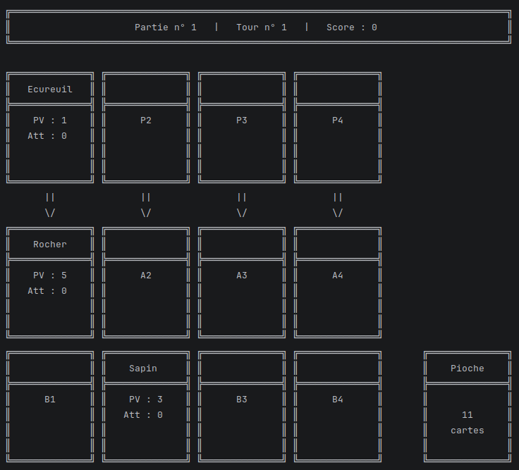
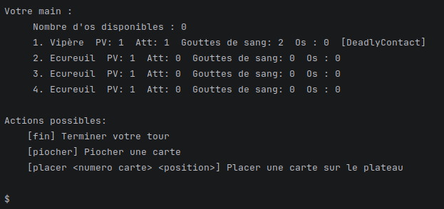

<!-- |-------------------------------------------------------------------------------------------| -->
<!-- |                                         LANGUAGE                                          | -->
<!-- |-------------------------------------------------------------------------------------------| -->
<div align="right">
  <a href="README.fr.md">
    
  </a>
  <a href="README.en.md">
    
  </a>
</div>

<!-- |-------------------------------------------------------------------------------------------| -->
<!-- |                                          HEADER                                           | -->
<!-- |-------------------------------------------------------------------------------------------| -->
<h1 align="left">♣️ Inscryption Card Game</h1>

<p align="justify">
Ce projet est un jeu de cartes en Java inspiré du jeu vidéo <i>Inscryption</i>. Vous êtes face à un adversaire et vous devez le vaincre à travers plusieurs manches. Ce projet a été réalisé dans le cadre d'une SAé en binôme, sur une durée de 5 semaines. Il consiste à modéliser les règles du jeu de cartes d'Inscryption : placement des cartes, combats, sacrifices et système de pouvoirs.
</p>

<!-- |-------------------------------------------------------------------------------------------| -->
<!-- |                                       À PROPOS                                            | -->
<!-- |-------------------------------------------------------------------------------------------| -->
## À propos du projet

<p align="justify">
Le jeu implémente un plateau avec une gestion des cartes obstacles, ainsi qu'un système de score basé sur l'écart de points entre les deux joueurs. Il propose différentes cartes animaux possédant chacune une attaque, des points de vie, un coût en sacrifices sous forme de gouttes de sang ou d'os, ainsi que des pouvoirs spéciaux.
</p>

<p align="justify">
Le jeu se déroule en trois manches, avec l'ajout de nouvelles cartes à la pioche entre chaque manche. Plusieurs pouvoirs de cartes sont disponibles, notamment nombreuses vies, croissance, puant, coureur, contact mortel et piques pointues, ainsi qu'une mécanique de pierre de sacrifice permettant de gérer certains sacrifices. Enfin, le jeu dispose d'une interface en ligne de commande permettant au joueur d'interagir avec le jeu, ainsi que d'une gestion des erreurs de saisie afin d'éviter les entrées invalides.
</p>

<!-- |-------------------------------------------------------------------------------------------| -->
<!-- |                                        APERÇU                                             | -->
<!-- |-------------------------------------------------------------------------------------------| -->
## 📸 Aperçu

**Image du plateau au début d'une partie :**
<div align="center">
  
</div>
<br>

**Image des actions possibles avec la main :**
<div align="center">
  
</div>
<br>

<!-- |-------------------------------------------------------------------------------------------| -->
<!-- |                                        UTILISATION                                        | -->
<!-- |-------------------------------------------------------------------------------------------| -->
## 🚀 Lancer le projet

<p align="justify">
Le projet est un projet IntelliJ IDEA. Pour le lancer, il faut ouvrir le dossier du projet dans IntelliJ, puis ouvrir le fichier <code>Main.java</code> dans le dossier <code>src</code>. Enfin, il faut lancer l'exécution en cliquant sur la flèche verte. Les bibliothèques nécessaires aux tests sont incluses dans le dossier <code>deps/</code>.
</p>

<!-- |-------------------------------------------------------------------------------------------| -->
<!-- |                                    STRUCTURE DU PROJET                                    | -->
<!-- |-------------------------------------------------------------------------------------------| -->
## 📁 Structure du projet

```text
Inscryption-card-game/
├── deps/                    # Dépendances
├── docs/                    # Sujet et consignes du projet
├── out/                     # Fichiers compilés
├── src/                     # Code source du jeu
│   ├── Main.java
│   └── ...
├── tests/                   # Tests unitaires JUnit
├── uml/                     # Diagrammes de classes avec évolution semaine par semaine
├── images/                  # Images utilisées dans le README
├── .gitignore
└── README.md
```

<!-- |-------------------------------------------------------------------------------------------| -->
<!-- |                                          TESTS                                            | -->
<!-- |-------------------------------------------------------------------------------------------| -->
## 🧪 Tests

<p align="justify">
Le projet est couvert par une suite de tests unitaires JUnit, portant notamment sur l'attaque d'une carte et l'attaque de toutes les cartes en fin de tour, les pouvoirs des cartes, le mécanisme de la pierre de sacrifice, la mise à jour du score, le placement des cartes sur le plateau et la pioche, ainsi que la mise en place d'une partie et les conditions de victoire ou de défaite.
</p>

<!-- |-------------------------------------------------------------------------------------------| -->
<!-- |                                       CONTRIBUTEURS                                       | -->
<!-- |-------------------------------------------------------------------------------------------| -->
## 👥 Contributeurs

Travail réalisé en binôme dans le cadre d'un projet à l'IUT Robert Schuman.

<div align="center">

[](https://github.com/rmax3iu)
[](https://github.com/lucastreiber)

</div>
